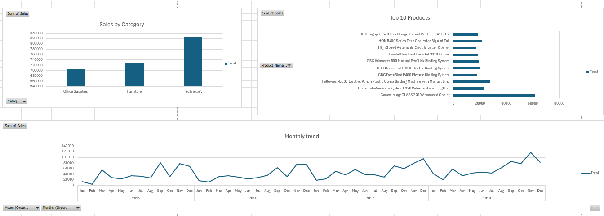

 📊 Sales Dashboard (Excel)

 Overview

This project is an interactive Sales Dashboard built using Microsoft Excel.
It helps analyze sales performance across regions, categories, and products.

 Features

* Sales by Region
* Sales by Category
* Top 10 Products
* Monthly Sales Trend
* Interactive Slicers (Region, Category, Segment)

Dashboard Preview

 Tools Used

* Microsoft Excel
* Pivot Tables
* Charts
* Slicers

 📁 Files

* sales-dashboard.xlsx
* dashboard.png

📈 Insights

* West region has highest sales
* Technology category performs best
* Top products contribute major revenue

